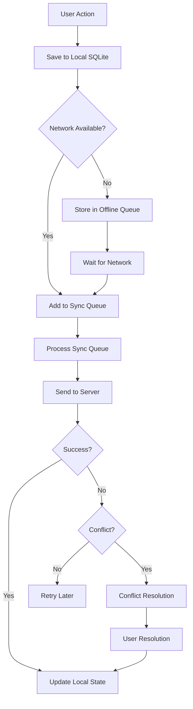
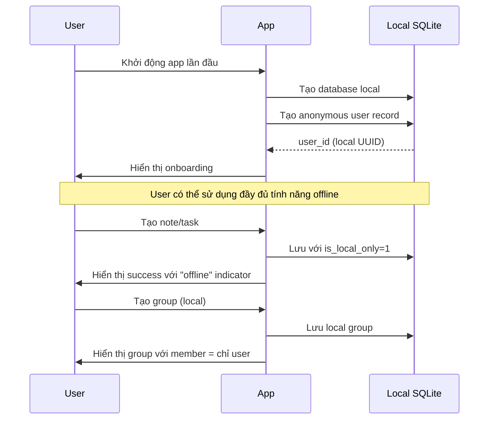
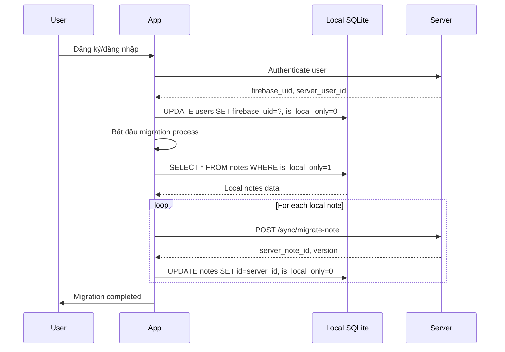

# Offline/Online Data Synchronization - NoteFlow

## Tổng quan

Tính năng đồng bộ dữ liệu offline/online là một trong những tính năng cốt lõi của NoteFlow, cho phép người dùng làm việc hiệu quả ngay cả khi không có kết nối mạng. Tài liệu này mô tả chi tiết kiến trúc, thiết kế và triển khai hệ thống đồng bộ.

## Mục tiêu thiết kế

### Trải nghiệm người dùng
- **Offline-first**: Người dùng có thể sử dụng app hoàn toàn offline mà không cần đăng nhập
- **Seamless Experience**: Chuyển đổi giữa offline/online không ảnh hưởng đến workflow
- **Data Integrity**: Đảm bảo tính toàn vẹn dữ liệu trong mọi trường hợp
- **Conflict Resolution**: Xử lý xung đột dữ liệu một cách thông minh và thân thiện

### Hiệu suất
- **Fast Sync**: Đồng bộ nhanh chóng với delta changes
- **Minimal Bandwidth**: Tối ưu băng thông mạng
- **Battery Efficient**: Tối ưu pin cho mobile devices
- **Scalability**: Hỗ trợ hàng nghìn người dùng đồng thời

## Kiến trúc tổng thể

### Nguyên tắc thiết kế

1. **Offline-first Architecture**
   - Mọi thao tác được lưu local trước
   - UI không bao giờ bị block do network requests
   - Graceful degradation cho features yêu cầu network

2. **Queue-based Synchronization**
   - Actions được queue khi offline
   - Xử lý queue theo thứ tự FIFO
   - Retry mechanism với exponential backoff

3. **Version-based Conflict Resolution**
   - Mỗi record có version number
   - Three-way merge cho text content
   - Last-write-wins cho metadata

4. **Smart Delta Sync**
   - Chỉ sync những thay đổi thực sự
   - Checksum-based change detection  
   - Incremental sync để giảm bandwidth

### Luồng hoạt động chính



## Database Design

### Offline Database (SQLite)

SQLite được sử dụng để lưu trữ dữ liệu local trên device. Thiết kế tương thích với PostgreSQL để dễ dàng sync.

#### Core Tables

```sql
-- Users (local cache and offline users)
CREATE TABLE users (
    id TEXT PRIMARY KEY,
    name TEXT NOT NULL,
    email TEXT,
    avatar_url TEXT,
    firebase_uid TEXT,
    is_local_only INTEGER DEFAULT 0, -- 1 for offline-only users
    last_active INTEGER,
    created_at INTEGER NOT NULL,
    updated_at INTEGER NOT NULL
);

-- Groups (với hỗ trợ offline groups)
CREATE TABLE groups (
    id TEXT PRIMARY KEY,
    name TEXT NOT NULL,
    description TEXT,
    creator_id TEXT NOT NULL,
    max_members INTEGER DEFAULT 5,
    is_local_only INTEGER DEFAULT 0, -- 1 for offline-only groups
    created_at INTEGER NOT NULL,
    updated_at INTEGER NOT NULL,
    FOREIGN KEY(creator_id) REFERENCES users(id)
);

-- Group members
CREATE TABLE group_members (
    id TEXT PRIMARY KEY,
    group_id TEXT NOT NULL,
    user_id TEXT NOT NULL,
    role TEXT NOT NULL DEFAULT 'member',
    joined_at INTEGER NOT NULL,
    FOREIGN KEY(group_id) REFERENCES groups(id) ON DELETE CASCADE,
    FOREIGN KEY(user_id) REFERENCES users(id) ON DELETE CASCADE,
    UNIQUE(group_id, user_id)
);

-- Notes với sync metadata
CREATE TABLE notes (
    id TEXT PRIMARY KEY,
    group_id TEXT NOT NULL,
    creator_id TEXT NOT NULL,
    parent_id TEXT,
    title TEXT NOT NULL,
    content TEXT,
    type TEXT NOT NULL CHECK (type IN ('note', 'task', 'issue')),
    status TEXT NOT NULL DEFAULT 'open',
    priority TEXT CHECK (priority IN ('low', 'medium', 'high')),
    severity TEXT CHECK (severity IN ('minor', 'major', 'critical')),
    deadline INTEGER,
    estimated_time INTEGER,
    tags TEXT, -- JSON array as string
    is_pinned INTEGER DEFAULT 0,
    
    -- Sync metadata
    version INTEGER DEFAULT 1,
    server_version INTEGER DEFAULT 0,
    is_local_only INTEGER DEFAULT 0, -- 1 if not synced to server
    sync_status TEXT DEFAULT 'pending', -- 'pending', 'synced', 'conflict'
    conflict_data TEXT, -- JSON data for conflict resolution
    
    created_at INTEGER NOT NULL,
    updated_at INTEGER NOT NULL,
    
    FOREIGN KEY(group_id) REFERENCES groups(id) ON DELETE CASCADE,
    FOREIGN KEY(creator_id) REFERENCES users(id),
    FOREIGN KEY(parent_id) REFERENCES notes(id) ON DELETE CASCADE
);

-- Comments với sync support
CREATE TABLE comments (
    id TEXT PRIMARY KEY,
    note_id TEXT NOT NULL,
    user_id TEXT NOT NULL,
    parent_comment_id TEXT,
    content TEXT NOT NULL,
    mentions TEXT, -- JSON array of user IDs
    
    -- Sync metadata
    version INTEGER DEFAULT 1,
    server_version INTEGER DEFAULT 0,
    is_local_only INTEGER DEFAULT 0,
    sync_status TEXT DEFAULT 'pending',
    
    created_at INTEGER NOT NULL,
    updated_at INTEGER NOT NULL,
    
    FOREIGN KEY(note_id) REFERENCES notes(id) ON DELETE CASCADE,
    FOREIGN KEY(user_id) REFERENCES users(id),
    FOREIGN KEY(parent_comment_id) REFERENCES comments(id) ON DELETE CASCADE
);

-- Assignments
CREATE TABLE assignments (
    id TEXT PRIMARY KEY,
    note_id TEXT NOT NULL,
    assignee_id TEXT NOT NULL,
    created_by TEXT NOT NULL,
    created_at INTEGER NOT NULL,
    
    FOREIGN KEY(note_id) REFERENCES notes(id) ON DELETE CASCADE,
    FOREIGN KEY(assignee_id) REFERENCES users(id),
    FOREIGN KEY(created_by) REFERENCES users(id)
);
```

#### Sync Management Tables

```sql
-- Sync queue for offline operations
CREATE TABLE sync_queue (
    id TEXT PRIMARY KEY,
    action TEXT NOT NULL CHECK (action IN ('create', 'update', 'delete')),
    table_name TEXT NOT NULL,
    record_id TEXT NOT NULL,
    data TEXT NOT NULL, -- JSON payload
    priority INTEGER DEFAULT 0, -- Higher number = higher priority
    created_at INTEGER NOT NULL,
    retry_count INTEGER DEFAULT 0,
    last_retry INTEGER,
    error_message TEXT,
    
    -- Group by batch_id for transaction-like operations
    batch_id TEXT,
    depends_on TEXT -- ID of another sync_queue item this depends on
);

-- Local sync metadata
CREATE TABLE sync_metadata (
    table_name TEXT NOT NULL,
    record_id TEXT NOT NULL,
    server_version INTEGER NOT NULL DEFAULT 0,
    local_version INTEGER NOT NULL DEFAULT 1,
    last_synced INTEGER NOT NULL,
    checksum TEXT, -- For detecting changes
    PRIMARY KEY (table_name, record_id)
);

-- Conflict resolution history
CREATE TABLE conflict_history (
    id TEXT PRIMARY KEY,
    table_name TEXT NOT NULL,
    record_id TEXT NOT NULL,
    conflict_type TEXT NOT NULL, -- 'content', 'metadata', 'delete'
    local_version INTEGER NOT NULL,
    server_version INTEGER NOT NULL,
    resolution_strategy TEXT NOT NULL, -- 'local', 'server', 'manual'
    resolved_data TEXT, -- JSON of resolved state
    resolved_at INTEGER NOT NULL,
    resolved_by TEXT -- user_id who resolved
);

-- Offline session tracking
CREATE TABLE offline_sessions (
    id TEXT PRIMARY KEY,
    user_id TEXT,
    start_time INTEGER NOT NULL,
    end_time INTEGER,
    actions_count INTEGER DEFAULT 0,
    notes_created INTEGER DEFAULT 0,
    notes_modified INTEGER DEFAULT 0,
    sync_completed INTEGER DEFAULT 0 -- 1 when fully synced
);

-- App settings và configuration
CREATE TABLE app_settings (
    key TEXT PRIMARY KEY,
    value TEXT NOT NULL,
    updated_at INTEGER NOT NULL
);
```

#### Indexes for Performance

```sql
-- Core indexes
CREATE INDEX idx_notes_group_id ON notes (group_id);
CREATE INDEX idx_notes_creator_id ON notes (creator_id);
CREATE INDEX idx_notes_parent_id ON notes (parent_id);
CREATE INDEX idx_notes_type_status ON notes (type, status);
CREATE INDEX idx_notes_updated_at ON notes (updated_at DESC);
CREATE INDEX idx_notes_sync_status ON notes (sync_status);

CREATE INDEX idx_comments_note_id ON comments (note_id);
CREATE INDEX idx_comments_user_id ON comments (user_id);
CREATE INDEX idx_comments_sync_status ON comments (sync_status);

-- Sync-specific indexes
CREATE INDEX idx_sync_queue_priority ON sync_queue (priority DESC, created_at ASC);
CREATE INDEX idx_sync_queue_action ON sync_queue (action);
CREATE INDEX idx_sync_queue_table_record ON sync_queue (table_name, record_id);
CREATE INDEX idx_sync_queue_batch ON sync_queue (batch_id);

CREATE INDEX idx_sync_metadata_table ON sync_metadata (table_name);
CREATE INDEX idx_sync_metadata_last_synced ON sync_metadata (last_synced);

-- Full-text search
CREATE VIRTUAL TABLE notes_fts USING fts5(
    title,
    content,
    tags,
    content='notes',
    content_rowid='rowid'
);

-- Triggers để maintain FTS
CREATE TRIGGER notes_ai AFTER INSERT ON notes BEGIN
    INSERT INTO notes_fts(rowid, title, content, tags) 
    VALUES (new.rowid, new.title, new.content, new.tags);
END;

CREATE TRIGGER notes_ad AFTER DELETE ON notes BEGIN
    INSERT INTO notes_fts(notes_fts, rowid, title, content, tags) 
    VALUES('delete', old.rowid, old.title, old.content, old.tags);
END;

CREATE TRIGGER notes_au AFTER UPDATE ON notes BEGIN
    INSERT INTO notes_fts(notes_fts, rowid, title, content, tags) 
    VALUES('delete', old.rowid, old.title, old.content, old.tags);
    INSERT INTO notes_fts(rowid, title, content, tags) 
    VALUES (new.rowid, new.title, new.content, new.tags);
END;
```

### Online Database (PostgreSQL)

PostgreSQL server database với các optimizations cho sync operations.

#### Sync-Optimized Schema

```sql
-- Enable necessary extensions
CREATE EXTENSION IF NOT EXISTS "uuid-ossp";
CREATE EXTENSION IF NOT EXISTS "pg_trgm";

-- Users table
CREATE TABLE users (
    id UUID PRIMARY KEY DEFAULT uuid_generate_v4(),
    name VARCHAR(255) NOT NULL,
    email VARCHAR(255) UNIQUE NOT NULL,
    avatar_url TEXT,
    firebase_uid VARCHAR(255) UNIQUE NOT NULL,
    last_active TIMESTAMP WITH TIME ZONE,
    version INTEGER DEFAULT 1,
    created_at TIMESTAMP WITH TIME ZONE DEFAULT NOW(),
    updated_at TIMESTAMP WITH TIME ZONE DEFAULT NOW()
);

-- Groups table
CREATE TABLE groups (
    id UUID PRIMARY KEY DEFAULT uuid_generate_v4(),
    name VARCHAR(255) NOT NULL,
    description TEXT,
    creator_id UUID NOT NULL REFERENCES users(id),
    max_members INTEGER DEFAULT 5,
    version INTEGER DEFAULT 1,
    created_at TIMESTAMP WITH TIME ZONE DEFAULT NOW(),
    updated_at TIMESTAMP WITH TIME ZONE DEFAULT NOW()
);

-- Notes với advanced sync support
CREATE TABLE notes (
    id UUID PRIMARY KEY DEFAULT uuid_generate_v4(),
    group_id UUID NOT NULL REFERENCES groups(id) ON DELETE CASCADE,
    creator_id UUID NOT NULL REFERENCES users(id),
    parent_id UUID REFERENCES notes(id) ON DELETE CASCADE,
    title VARCHAR(500) NOT NULL,
    content TEXT,
    type VARCHAR(20) NOT NULL CHECK (type IN ('note', 'task', 'issue')),
    status VARCHAR(20) NOT NULL DEFAULT 'open',
    priority VARCHAR(10) CHECK (priority IN ('low', 'medium', 'high')),
    severity VARCHAR(20) CHECK (severity IN ('minor', 'major', 'critical')),
    deadline TIMESTAMP WITH TIME ZONE,
    estimated_time INTEGER,
    tags JSONB DEFAULT '[]',
    is_pinned BOOLEAN DEFAULT FALSE,
    
    -- Advanced sync metadata
    version INTEGER DEFAULT 1,
    content_hash VARCHAR(64), -- SHA-256 of content for change detection
    last_modified_by UUID REFERENCES users(id),
    
    created_at TIMESTAMP WITH TIME ZONE DEFAULT NOW(),
    updated_at TIMESTAMP WITH TIME ZONE DEFAULT NOW()
);

-- Comments table
CREATE TABLE comments (
    id UUID PRIMARY KEY DEFAULT uuid_generate_v4(),
    note_id UUID NOT NULL REFERENCES notes(id) ON DELETE CASCADE,
    user_id UUID NOT NULL REFERENCES users(id),
    parent_comment_id UUID REFERENCES comments(id) ON DELETE CASCADE,
    content TEXT NOT NULL,
    mentions UUID[] DEFAULT '{}',
    version INTEGER DEFAULT 1,
    content_hash VARCHAR(64),
    created_at TIMESTAMP WITH TIME ZONE DEFAULT NOW(),
    updated_at TIMESTAMP WITH TIME ZONE DEFAULT NOW()
);

-- Sync log để track tất cả changes
CREATE TABLE sync_log (
    id UUID PRIMARY KEY DEFAULT uuid_generate_v4(),
    user_id UUID NOT NULL REFERENCES users(id) ON DELETE CASCADE,
    table_name VARCHAR(50) NOT NULL,
    record_id UUID NOT NULL,
    action VARCHAR(20) NOT NULL CHECK (action IN ('create', 'update', 'delete')),
    old_data JSONB,
    new_data JSONB,
    sync_timestamp TIMESTAMP WITH TIME ZONE DEFAULT NOW(),
    client_timestamp TIMESTAMP WITH TIME ZONE,
    device_id VARCHAR(255)
);

-- Sync conflicts tracking
CREATE TABLE sync_conflicts (
    id UUID PRIMARY KEY DEFAULT uuid_generate_v4(),
    user_id UUID NOT NULL REFERENCES users(id),
    table_name VARCHAR(50) NOT NULL,
    record_id UUID NOT NULL,
    local_version INTEGER NOT NULL,
    server_version INTEGER NOT NULL,
    local_data JSONB NOT NULL,
    server_data JSONB NOT NULL,
    conflict_type VARCHAR(50) NOT NULL, -- 'content', 'metadata', 'delete'
    status VARCHAR(20) DEFAULT 'pending', -- 'pending', 'resolved', 'ignored'
    created_at TIMESTAMP WITH TIME ZONE DEFAULT NOW(),
    resolved_at TIMESTAMP WITH TIME ZONE,
    resolution_data JSONB
);

-- Server-side sync queue cho các operations cần xử lý
CREATE TABLE server_sync_queue (
    id UUID PRIMARY KEY DEFAULT uuid_generate_v4(),
    user_id UUID NOT NULL REFERENCES users(id),
    action VARCHAR(20) NOT NULL,
    table_name VARCHAR(50) NOT NULL,
    record_id UUID NOT NULL,
    payload JSONB NOT NULL,
    priority INTEGER DEFAULT 0,
    status VARCHAR(20) DEFAULT 'pending', -- 'pending', 'processing', 'completed', 'failed'
    created_at TIMESTAMP WITH TIME ZONE DEFAULT NOW(),
    processed_at TIMESTAMP WITH TIME ZONE,
    error_message TEXT
);
```

#### Database Triggers for Auto-sync

```sql
-- Function để auto-update timestamps
CREATE OR REPLACE FUNCTION update_updated_at_column()
RETURNS TRIGGER AS $$
BEGIN
    NEW.updated_at = NOW();
    RETURN NEW;
END;
$$ language 'plpgsql';

-- Function để auto-increment version
CREATE OR REPLACE FUNCTION increment_version()
RETURNS TRIGGER AS $$
BEGIN
    NEW.version = COALESCE(OLD.version, 0) + 1;
    NEW.updated_at = NOW();
    RETURN NEW;
END;
$$ language 'plpgsql';

-- Function để generate content hash
CREATE OR REPLACE FUNCTION update_content_hash()
RETURNS TRIGGER AS $$
BEGIN
    IF TG_TABLE_NAME = 'notes' THEN
        NEW.content_hash = encode(sha256((NEW.title || COALESCE(NEW.content, ''))::bytea), 'hex');
    ELSIF TG_TABLE_NAME = 'comments' THEN
        NEW.content_hash = encode(sha256(NEW.content::bytea), 'hex');
    END IF;
    RETURN NEW;
END;
$$ language 'plpgsql';

-- Function để log changes cho sync
CREATE OR REPLACE FUNCTION log_changes()
RETURNS TRIGGER AS $$
BEGIN
    IF TG_OP = 'DELETE' THEN
        INSERT INTO sync_log (user_id, table_name, record_id, action, old_data)
        VALUES (OLD.creator_id, TG_TABLE_NAME, OLD.id, 'delete', to_jsonb(OLD));
        RETURN OLD;
    ELSIF TG_OP = 'UPDATE' THEN
        INSERT INTO sync_log (user_id, table_name, record_id, action, old_data, new_data)
        VALUES (NEW.creator_id, TG_TABLE_NAME, NEW.id, 'update', to_jsonb(OLD), to_jsonb(NEW));
        RETURN NEW;
    ELSIF TG_OP = 'INSERT' THEN
        INSERT INTO sync_log (user_id, table_name, record_id, action, new_data)
        VALUES (NEW.creator_id, TG_TABLE_NAME, NEW.id, 'create', to_jsonb(NEW));
        RETURN NEW;
    END IF;
    RETURN NULL;
END;
$$ language 'plpgsql';

-- Apply triggers
CREATE TRIGGER update_users_updated_at BEFORE UPDATE ON users
    FOR EACH ROW EXECUTE FUNCTION update_updated_at_column();
    
CREATE TRIGGER update_groups_updated_at BEFORE UPDATE ON groups
    FOR EACH ROW EXECUTE FUNCTION update_updated_at_column();

CREATE TRIGGER increment_notes_version BEFORE UPDATE ON notes
    FOR EACH ROW EXECUTE FUNCTION increment_version();
    
CREATE TRIGGER increment_comments_version BEFORE UPDATE ON comments
    FOR EACH ROW EXECUTE FUNCTION increment_version();

CREATE TRIGGER update_notes_content_hash BEFORE INSERT OR UPDATE ON notes
    FOR EACH ROW EXECUTE FUNCTION update_content_hash();
    
CREATE TRIGGER update_comments_content_hash BEFORE INSERT OR UPDATE ON comments
    FOR EACH ROW EXECUTE FUNCTION update_content_hash();

CREATE TRIGGER log_notes_changes AFTER INSERT OR UPDATE OR DELETE ON notes
    FOR EACH ROW EXECUTE FUNCTION log_changes();
    
CREATE TRIGGER log_comments_changes AFTER INSERT OR UPDATE OR DELETE ON comments
    FOR EACH ROW EXECUTE FUNCTION log_changes();
```

## Synchronization Algorithms

### 1. Offline-First User Experience

#### Anonymous User Flow



#### Transition to Online User



### 2. Real-time Sync Algorithm

#### Change Detection

```typescript
interface ChangeDetection {
  // Local change detection
  detectLocalChanges(): Promise<LocalChange[]> {
    const changes = await db.execute(`
      SELECT table_name, record_id, local_version, server_version, checksum
      FROM sync_metadata 
      WHERE local_version > server_version 
      OR checksum != last_synced_checksum
    `);
    
    return changes.map(change => ({
      table: change.table_name,
      recordId: change.record_id,
      action: this.determineAction(change),
      data: this.getRecordData(change.table_name, change.record_id)
    }));
  }
  
  // Server change detection
  async getServerChanges(lastSyncTime: number): Promise<ServerChange[]> {
    const response = await api.get('/sync/changes', {
      params: { since: lastSyncTime, userId: this.userId }
    });
    
    return response.data.changes;
  }
}
```

#### Three-way Merge Algorithm

```typescript
interface MergeStrategy {
  async threeWayMerge(
    base: any,      // Last known common version
    local: any,     // Local version
    server: any     // Server version
  ): Promise<MergeResult> {
    
    // Simple metadata merge (last-write-wins)
    if (this.isMetadataOnly(base, local, server)) {
      return {
        merged: server.updated_at > local.updated_at ? server : local,
        strategy: 'last-write-wins'
      };
    }
    
    // Content merge for text fields
    if (this.hasContentChanges(base, local, server)) {
      const merged = await this.mergeTextContent(
        base.content, 
        local.content, 
        server.content
      );
      
      if (merged.conflicts.length > 0) {
        return {
          merged: null,
          conflicts: merged.conflicts,
          strategy: 'manual-resolution-required'
        };
      }
      
      return {
        merged: { ...server, content: merged.result },
        strategy: 'three-way-merge'
      };
    }
    
    return { merged: server, strategy: 'server-wins' };
  }
}
```

### 3. Sync Queue Processing

#### Queue Management

```typescript
class SyncQueueManager {
  async processSyncQueue(): Promise<void> {
    const items = await this.getQueueItems();
    
    // Group items by batch_id for transaction-like processing
    const batches = this.groupByBatch(items);
    
    for (const batch of batches) {
      await this.processBatch(batch);
    }
  }
  
  private async processBatch(items: SyncQueueItem[]): Promise<void> {
    // Sort by dependencies and priority
    const sortedItems = this.topologicalSort(items);
    
    for (const item of sortedItems) {
      try {
        await this.processItem(item);
        await this.removeFromQueue(item.id);
      } catch (error) {
        await this.handleSyncError(item, error);
      }
    }
  }
  
  private async processItem(item: SyncQueueItem): Promise<void> {
    const payload = {
      action: item.action,
      table: item.table_name,
      recordId: item.record_id,
      data: JSON.parse(item.data),
      clientVersion: await this.getLocalVersion(item.table_name, item.record_id)
    };
    
    const response = await this.api.post('/sync/process', payload);
    
    if (response.data.conflict) {
      await this.handleConflict(item, response.data);
    } else {
      await this.updateLocalFromServer(item, response.data);
    }
  }
}
```

### 4. Conflict Resolution Strategies

#### Automatic Resolution

```typescript
class ConflictResolver {
  async autoResolve(conflict: SyncConflict): Promise<ResolutionResult> {
    switch (conflict.type) {
      case 'metadata-only':
        return this.lastWriteWins(conflict);
        
      case 'content-append':
        return this.appendChanges(conflict);
        
      case 'non-overlapping':
        return this.mergeNonOverlapping(conflict);
        
      default:
        return { requiresManualResolution: true };
    }
  }
  
  private lastWriteWins(conflict: SyncConflict): ResolutionResult {
    const localTime = new Date(conflict.local.updated_at);
    const serverTime = new Date(conflict.server.updated_at);
    
    return {
      resolved: serverTime > localTime ? conflict.server : conflict.local,
      strategy: 'last-write-wins'
    };
  }
  
  private async appendChanges(conflict: SyncConflict): Promise<ResolutionResult> {
    // For cases like adding comments, tags, etc.
    const merged = {
      ...conflict.server,
      // Merge arrays
      tags: [...new Set([...conflict.local.tags, ...conflict.server.tags])],
      // Append content if both added
      content: this.mergeAppendableContent(conflict.local.content, conflict.server.content)
    };
    
    return { resolved: merged, strategy: 'append-merge' };
  }
}
```

#### Manual Resolution UI

```typescript
interface ConflictResolutionUI {
  showConflictDialog(conflict: SyncConflict): Promise<UserResolution> {
    return new Promise((resolve) => {
      const dialog = {
        title: 'Xung đột dữ liệu',
        localVersion: conflict.local,
        serverVersion: conflict.server,
        baseVersion: conflict.base,
        options: [
          { id: 'keep-local', label: 'Giữ phiên bản của tôi' },
          { id: 'use-server', label: 'Sử dụng phiên bản từ server' },
          { id: 'merge-manual', label: 'Gộp thủ công' }
        ],
        onResolve: (resolution) => resolve(resolution)
      };
      
      this.displayDialog(dialog);
    });
  }
  
  showMergeEditor(conflict: SyncConflict): Promise<MergedContent> {
    // Implementation để hiển thị side-by-side editor
    // với highlighting differences và merge tools
  }
}
```

## API Design for Synchronization

### Sync Endpoints

#### 1. Initial Sync
```http
GET /api/v1/sync/initial
Authorization: Bearer <token>
Query Parameters:
  - last_sync_time: ISO timestamp (optional)
  - tables: comma-separated table names (optional)

Response:
{
  "sync_token": "uuid-v4",
  "server_time": "2024-01-15T10:30:00Z",
  "data": {
    "notes": [...],
    "comments": [...],
    "groups": [...]
  },
  "deletions": {
    "notes": ["deleted-note-id-1"],
    "comments": ["deleted-comment-id-1"]
  }
}
```

#### 2. Delta Sync
```http
POST /api/v1/sync/delta
Authorization: Bearer <token>
Content-Type: application/json

Request:
{
  "sync_token": "previous-sync-token",
  "client_changes": [
    {
      "action": "create|update|delete",
      "table": "notes",
      "record_id": "local-uuid",
      "data": {...},
      "local_version": 2,
      "client_timestamp": "2024-01-15T10:25:00Z"
    }
  ]
}

Response:
{
  "sync_token": "new-sync-token", 
  "server_time": "2024-01-15T10:30:00Z",
  "processed_changes": [
    {
      "client_record_id": "local-uuid",
      "server_record_id": "server-uuid",
      "status": "success|conflict|error",
      "server_version": 3,
      "conflict_data": {...} // if status == "conflict"
    }
  ],
  "server_changes": [
    {
      "action": "update",
      "table": "notes", 
      "record_id": "server-uuid",
      "data": {...},
      "version": 4
    }
  ]
}
```

#### 3. Conflict Resolution
```http
POST /api/v1/sync/resolve-conflict
Authorization: Bearer <token>
Content-Type: application/json

Request:
{
  "conflict_id": "conflict-uuid",
  "resolution_strategy": "local|server|manual",
  "merged_data": {...}, // Required if strategy == "manual"
  "client_version": 2,
  "server_version": 3
}

Response:
{
  "status": "resolved",
  "final_data": {...},
  "new_version": 4
}
```

#### 4. Migration Endpoint (Offline to Online)
```http
POST /api/v1/sync/migrate
Authorization: Bearer <token>
Content-Type: application/json

Request:
{
  "offline_data": {
    "user": {...},
    "groups": [...],
    "notes": [...],
    "comments": [...]
  },
  "device_id": "unique-device-identifier"
}

Response:
{
  "migration_id": "migration-uuid",
  "id_mappings": {
    "notes": {
      "local-id-1": "server-uuid-1",
      "local-id-2": "server-uuid-2"
    },
    "groups": {...}
  },
  "conflicts": [...] // Any conflicts found during migration
}
```

### Sync Service Implementation

```typescript
class SyncService {
  private syncToken: string | null = null;
  private lastSyncTime: Date | null = null;
  
  async fullSync(): Promise<void> {
    try {
      // Step 1: Get server changes
      const serverChanges = await this.getServerChanges();
      
      // Step 2: Get local changes  
      const localChanges = await this.getLocalChanges();
      
      // Step 3: Send local changes to server
      const syncResult = await this.sendLocalChanges(localChanges);
      
      // Step 4: Handle conflicts
      await this.handleConflicts(syncResult.conflicts);
      
      // Step 5: Apply server changes locally
      await this.applyServerChanges(syncResult.server_changes);
      
      // Step 6: Update sync metadata
      await this.updateSyncMetadata(syncResult.sync_token);
      
    } catch (error) {
      await this.handleSyncError(error);
    }
  }
  
  private async getServerChanges(): Promise<ServerChange[]> {
    const response = await api.get('/sync/initial', {
      params: {
        last_sync_time: this.lastSyncTime?.toISOString(),
        sync_token: this.syncToken
      }
    });
    
    return response.data;
  }
  
  private async sendLocalChanges(changes: LocalChange[]): Promise<SyncResult> {
    if (changes.length === 0) return { conflicts: [], server_changes: [] };
    
    const response = await api.post('/sync/delta', {
      sync_token: this.syncToken,
      client_changes: changes
    });
    
    return response.data;
  }
}
```

## Performance Optimizations

### 1. Efficient Data Transfer

#### Compression
```typescript
class SyncCompression {
  async compressPayload(data: any): Promise<string> {
    const json = JSON.stringify(data);
    return await this.gzipCompress(json);
  }
  
  async decompressPayload(compressed: string): Promise<any> {
    const json = await this.gzipDecompress(compressed);
    return JSON.parse(json);
  }
}
```

#### Delta-only Sync
```typescript
class DeltaCalculator {
  calculateDelta(original: any, modified: any): Delta {
    const changes = {};
    
    for (const key in modified) {
      if (original[key] !== modified[key]) {
        changes[key] = {
          old: original[key],
          new: modified[key]
        };
      }
    }
    
    return { 
      recordId: modified.id,
      changes: changes,
      checksum: this.calculateChecksum(modified)
    };
  }
}
```

### 2. Background Sync

```typescript
class BackgroundSyncManager {
  private syncInterval: number = 30000; // 30 seconds
  private isOnline: boolean = navigator.onLine;
  
  startBackgroundSync(): void {
    // Listen for network changes
    window.addEventListener('online', () => {
      this.isOnline = true;
      this.triggerSync();
    });
    
    window.addEventListener('offline', () => {
      this.isOnline = false;
    });
    
    // Periodic sync when online
    setInterval(() => {
      if (this.isOnline && !this.isSyncing) {
        this.triggerSync();
      }
    }, this.syncInterval);
  }
  
  private async triggerSync(): Promise<void> {
    try {
      this.isSyncing = true;
      await this.syncService.fullSync();
    } finally {
      this.isSyncing = false;
    }
  }
}
```

### 3. Caching Strategy

```typescript
class SyncCache {
  private readonly CACHE_EXPIRY = 5 * 60 * 1000; // 5 minutes
  
  async getCachedData(key: string): Promise<any> {
    const cached = await this.storage.get(key);
    
    if (!cached) return null;
    
    const age = Date.now() - cached.timestamp;
    if (age > this.CACHE_EXPIRY) {
      await this.storage.remove(key);
      return null;
    }
    
    return cached.data;
  }
  
  async setCachedData(key: string, data: any): Promise<void> {
    await this.storage.set(key, {
      data: data,
      timestamp: Date.now()
    });
  }
}
```

## Security Considerations

### 1. Data Encryption

```typescript
class SyncSecurity {
  async encryptSensitiveData(data: any): Promise<string> {
    const key = await this.getEncryptionKey();
    return await this.aesEncrypt(JSON.stringify(data), key);
  }
  
  async decryptSensitiveData(encrypted: string): Promise<any> {
    const key = await this.getEncryptionKey();
    const decrypted = await this.aesDecrypt(encrypted, key);
    return JSON.parse(decrypted);
  }
  
  private async getEncryptionKey(): Promise<CryptoKey> {
    // Generate key from user credentials or device key
    const keyMaterial = await this.getKeyMaterial();
    return await window.crypto.subtle.deriveKey(
      {
        name: "PBKDF2",
        salt: this.getSalt(),
        iterations: 100000,
        hash: "SHA-256"
      },
      keyMaterial,
      { name: "AES-GCM", length: 256 },
      false,
      ["encrypt", "decrypt"]
    );
  }
}
```

### 2. Authentication & Authorization

```typescript
class SyncAuth {
  async authenticateSync(request: SyncRequest): Promise<boolean> {
    // Verify JWT token
    const token = request.headers.authorization?.replace('Bearer ', '');
    if (!token) return false;
    
    try {
      const decoded = jwt.verify(token, process.env.JWT_SECRET);
      request.userId = decoded.uid;
      return true;
    } catch (error) {
      return false;
    }
  }
  
  async authorizeAccess(userId: string, resourceId: string, action: string): Promise<boolean> {
    // Check if user has permission to sync this resource
    const permissions = await this.getUserPermissions(userId, resourceId);
    return permissions.includes(action);
  }
}
```

### 3. Data Validation

```typescript
class SyncValidator {
  validateSyncRequest(request: SyncRequest): ValidationResult {
    const errors = [];
    
    // Validate data structure
    if (!this.isValidStructure(request.data)) {
      errors.push('Invalid data structure');
    }
    
    // Validate business rules
    if (!this.validateBusinessRules(request)) {
      errors.push('Business rule validation failed');
    }
    
    // Validate data integrity
    if (!this.validateDataIntegrity(request)) {
      errors.push('Data integrity check failed');
    }
    
    return {
      isValid: errors.length === 0,
      errors: errors
    };
  }
}
```

## Testing Strategy

### 1. Unit Tests

```typescript
describe('SyncService', () => {
  let syncService: SyncService;
  let mockDb: MockDatabase;
  let mockApi: MockApi;
  
  beforeEach(() => {
    mockDb = new MockDatabase();
    mockApi = new MockApi();
    syncService = new SyncService(mockDb, mockApi);
  });
  
  describe('conflict resolution', () => {
    test('should resolve simple metadata conflicts with last-write-wins', async () => {
      const conflict = {
        local: { id: '1', title: 'Local Title', updated_at: '2024-01-01T10:00:00Z' },
        server: { id: '1', title: 'Server Title', updated_at: '2024-01-01T11:00:00Z' }
      };
      
      const result = await syncService.resolveConflict(conflict);
      
      expect(result.resolved.title).toBe('Server Title');
      expect(result.strategy).toBe('last-write-wins');
    });
    
    test('should detect content conflicts requiring manual resolution', async () => {
      const conflict = {
        base: { content: 'Original content' },
        local: { content: 'Local changes to content' },
        server: { content: 'Server changes to content' }
      };
      
      const result = await syncService.resolveConflict(conflict);
      
      expect(result.requiresManualResolution).toBe(true);
    });
  });
  
  describe('queue processing', () => {
    test('should process sync queue in correct order', async () => {
      mockDb.addToSyncQueue([
        { id: '1', action: 'create', priority: 1, depends_on: null },
        { id: '2', action: 'update', priority: 2, depends_on: '1' },
        { id: '3', action: 'delete', priority: 1, depends_on: null }
      ]);
      
      await syncService.processSyncQueue();
      
      const processOrder = mockApi.getRequestOrder();
      expect(processOrder).toEqual(['1', '3', '2']); // Dependency order
    });
  });
});
```

### 2. Integration Tests

```typescript
describe('End-to-End Sync', () => {
  let app: TestApp;
  let server: TestServer;
  
  beforeEach(async () => {
    server = await TestServer.start();
    app = await TestApp.create({ serverUrl: server.url });
  });
  
  afterEach(async () => {
    await app.close();
    await server.stop();
  });
  
  test('offline user migration to online', async () => {
    // Create offline user and data
    await app.createOfflineUser('test@example.com');
    const noteId = await app.createNote({ title: 'Offline Note', content: 'Content' });
    
    // Go online and register
    await app.goOnline();
    await app.register('test@example.com', 'password123');
    
    // Verify data migration
    const onlineNotes = await app.getNotes();
    expect(onlineNotes).toHaveLength(1);
    expect(onlineNotes[0].title).toBe('Offline Note');
    
    // Verify data exists on server
    const serverNotes = await server.getNotes(app.userId);
    expect(serverNotes).toHaveLength(1);
  });
  
  test('multi-device sync', async () => {
    // Device 1 creates note
    const device1 = await TestApp.create({ deviceId: 'device1' });
    await device1.login('user@example.com', 'password');
    const noteId = await device1.createNote({ title: 'Multi-device Note' });
    
    // Device 2 syncs and should see the note
    const device2 = await TestApp.create({ deviceId: 'device2' });
    await device2.login('user@example.com', 'password');
    await device2.sync();
    
    const device2Notes = await device2.getNotes();
    expect(device2Notes).toHaveLength(1);
    expect(device2Notes[0].title).toBe('Multi-device Note');
  });
});
```

### 3. Performance Tests

```typescript
describe('Sync Performance', () => {
  test('large dataset sync should complete within SLA', async () => {
    // Setup large dataset (1000 notes, 5000 comments)
    const largeDataset = generateLargeDataset(1000, 5000);
    await testDb.seedData(largeDataset);
    
    const startTime = Date.now();
    await syncService.fullSync();
    const syncTime = Date.now() - startTime;
    
    // Should complete within 5 seconds as per SLA
    expect(syncTime).toBeLessThan(5000);
  });
  
  test('incremental sync should be efficient', async () => {
    // Perform initial sync
    await syncService.fullSync();
    
    // Make small changes
    await testDb.updateNote(noteId, { title: 'Updated Title' });
    
    const startTime = Date.now();
    await syncService.incrementalSync();
    const syncTime = Date.now() - startTime;
    
    // Incremental sync should be very fast
    expect(syncTime).toBeLessThan(1000);
  });
});
```

## Error Handling & Recovery

### 1. Network Error Recovery

```typescript
class NetworkErrorHandler {
  private retryDelays = [1000, 2000, 4000, 8000, 16000]; // Exponential backoff
  
  async handleNetworkError(error: NetworkError, operation: () => Promise<any>): Promise<any> {
    let lastError = error;
    
    for (let i = 0; i < this.retryDelays.length; i++) {
      await this.delay(this.retryDelays[i]);
      
      try {
        return await operation();
      } catch (retryError) {
        lastError = retryError;
        
        if (!this.isRetryableError(retryError)) {
          throw retryError;
        }
      }
    }
    
    // All retries failed
    throw new Error(`Operation failed after ${this.retryDelays.length} retries: ${lastError.message}`);
  }
  
  private isRetryableError(error: any): boolean {
    // Network timeouts, 5xx errors are retryable
    // 4xx client errors (except 429) are not retryable
    return error.code === 'NETWORK_ERROR' || 
           error.code === 'TIMEOUT' || 
           (error.status >= 500 && error.status < 600) ||
           error.status === 429; // Rate limit
  }
}
```

### 2. Data Corruption Recovery

```typescript
class DataRecoveryService {
  async detectCorruption(): Promise<CorruptionReport> {
    const issues = [];
    
    // Check referential integrity
    const orphanedRecords = await this.findOrphanedRecords();
    if (orphanedRecords.length > 0) {
      issues.push({ type: 'orphaned_records', count: orphanedRecords.length });
    }
    
    // Check data consistency
    const inconsistencies = await this.findDataInconsistencies();
    if (inconsistencies.length > 0) {
      issues.push({ type: 'data_inconsistency', count: inconsistencies.length });
    }
    
    // Check version mismatches
    const versionMismatches = await this.findVersionMismatches();
    if (versionMismatches.length > 0) {
      issues.push({ type: 'version_mismatch', count: versionMismatches.length });
    }
    
    return {
      isCorrupted: issues.length > 0,
      issues: issues
    };
  }
  
  async recoverFromCorruption(report: CorruptionReport): Promise<void> {
    for (const issue of report.issues) {
      switch (issue.type) {
        case 'orphaned_records':
          await this.cleanupOrphanedRecords();
          break;
        case 'data_inconsistency':
          await this.fixDataInconsistencies();
          break;
        case 'version_mismatch':
          await this.resolveVersionMismatches();
          break;
      }
    }
    
    // Re-sync from server as final recovery step
    await this.forceSyncFromServer();
  }
}
```

### 3. Graceful Degradation

```typescript
class SyncDegradationManager {
  private degradationLevel = 0;
  
  async handleDegradation(error: SyncError): Promise<void> {
    this.degradationLevel++;
    
    switch (this.degradationLevel) {
      case 1:
        // Level 1: Increase sync intervals
        await this.increaseSyncInterval(2);
        break;
        
      case 2:
        // Level 2: Disable real-time sync, only manual sync
        await this.disableBackgroundSync();
        break;
        
      case 3:
        // Level 3: Full offline mode
        await this.enableOfflineOnlyMode();
        break;
    }
    
    // Auto-recovery check
    setTimeout(() => this.checkRecovery(), 60000); // Check every minute
  }
  
  private async checkRecovery(): Promise<void> {
    try {
      await this.testConnection();
      // Connection recovered, reduce degradation
      this.degradationLevel = Math.max(0, this.degradationLevel - 1);
      await this.restoreNormalOperation();
    } catch (error) {
      // Still having issues, maintain current degradation level
    }
  }
}
```

## Monitoring & Analytics

### 1. Sync Performance Metrics

```typescript
class SyncMetrics {
  async recordSyncMetrics(syncOperation: SyncOperation): Promise<void> {
    const metrics = {
      operation_type: syncOperation.type,
      duration_ms: syncOperation.duration,
      records_processed: syncOperation.recordCount,
      conflicts_detected: syncOperation.conflictCount,
      errors_encountered: syncOperation.errorCount,
      bandwidth_used: syncOperation.bytesTransferred,
      timestamp: new Date().toISOString()
    };
    
    await this.analyticsService.track('sync_operation', metrics);
  }
  
  async getSyncHealthReport(): Promise<SyncHealthReport> {
    const last24Hours = Date.now() - (24 * 60 * 60 * 1000);
    
    const metrics = await this.analyticsService.query({
      event: 'sync_operation',
      timeRange: { start: last24Hours, end: Date.now() }
    });
    
    return {
      totalSyncs: metrics.length,
      averageDuration: this.calculateAverage(metrics, 'duration_ms'),
      successRate: this.calculateSuccessRate(metrics),
      conflictRate: this.calculateConflictRate(metrics),
      bandwidthUsage: this.sumBandwidth(metrics)
    };
  }
}
```

### 2. User Experience Monitoring

```typescript
class SyncUXMonitoring {
  async trackUserFriction(event: UXEvent): Promise<void> {
    const frictionEvents = [
      'sync_conflict_shown',
      'manual_resolution_required',
      'sync_timeout',
      'offline_mode_activated'
    ];
    
    if (frictionEvents.includes(event.type)) {
      await this.analyticsService.track('sync_friction', {
        event_type: event.type,
        user_id: event.userId,
        context: event.context,
        resolved: event.resolved,
        resolution_time_ms: event.resolutionTime
      });
    }
  }
  
  async generateUXReport(): Promise<UXReport> {
    // Generate report on user experience with sync
    // - How often users encounter conflicts
    // - Time to resolve conflicts
    // - Offline usage patterns
    // - Success/failure rates
  }
}
```

## Future Enhancements

### 1. Real-time Collaboration

```typescript
interface RealTimeSync {
  // WebSocket-based real-time updates
  enableRealTimeSync(noteId: string): Promise<void>;
  
  // Operational Transform for concurrent editing
  applyOperation(operation: TextOperation): Promise<void>;
  
  // Presence indicators
  trackPresence(noteId: string): Promise<PresenceInfo[]>;
}
```

### 2. AI-Powered Conflict Resolution

```typescript
interface AIConflictResolver {
  // Use ML to suggest best resolution strategy
  suggestResolution(conflict: SyncConflict): Promise<ResolutionSuggestion>;
  
  // Learn from user resolution patterns
  learnFromResolution(conflict: SyncConflict, userChoice: Resolution): Promise<void>;
}
```

### 3. P2P Sync for Local Networks

```typescript
interface P2PSync {
  // Direct device-to-device sync on local network
  discoverPeers(): Promise<PeerDevice[]>;
  
  // Sync without internet connection
  syncWithPeer(peerId: string): Promise<void>;
}
```

## Conclusion

Hệ thống đồng bộ offline/online của NoteFlow được thiết kế để cung cấp trải nghiệm người dùng mượt mà và đáng tin cậy. Kiến trúc offline-first đảm bảo ứng dụng luôn phản hồi nhanh, trong khi hệ thống sync thông minh xử lý việc đồng bộ dữ liệu một cách hiệu quả.

### Điểm mạnh chính:

1. **Offline-first**: Hoạt động hoàn toàn offline không cần đăng nhập
2. **Smart Sync**: Chỉ sync những thay đổi thực sự cần thiết
3. **Conflict Resolution**: Xử lý xung đột tự động và thủ công thông minh
4. **Performance**: Tối ưu cho mobile devices và bandwidth hạn chế
5. **Security**: Bảo mật dữ liệu trong quá trình sync
6. **Reliability**: Xử lý lỗi và recovery mạnh mẽ

### Roadmap triển khai:

- **Phase 1**: Core offline functionality và basic sync
- **Phase 2**: Advanced conflict resolution và performance optimization
- **Phase 3**: Real-time collaboration features
- **Phase 4**: AI-powered enhancements và P2P sync

Tài liệu này sẽ được cập nhật liên tục khi có thêm requirements và feedback từ quá trình triển khai thực tế.