# User Flows - NoteFlow

## Tổng quan

Tài liệu này mô tả chi tiết các user flows chính trong ứng dụng NoteFlow, từ onboarding đến các tính năng nâng cao. Mỗi flow được thiết kế để tối ưu trải nghiệm người dùng và đảm bảo hiệu quả công việc.

## Flow 1: User Onboarding & First Experience

### 1.1 Registration Flow

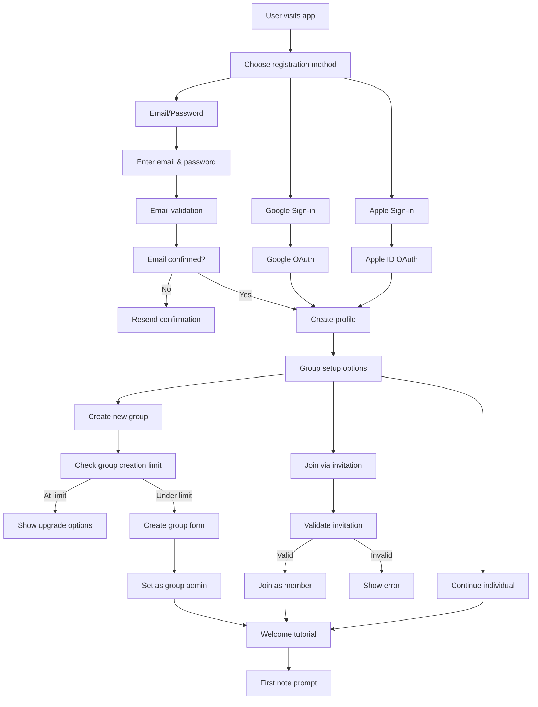

#### Detailed Steps

**Step 1: Landing Screen**
- Hero image showcasing app features
- "Get Started" CTA button
- "Already have an account? Sign in" link
- Brief feature highlights

**Step 2: Registration Method Selection**
```typescript
interface RegistrationOptions {
  email: boolean;
  google: boolean;
  apple: boolean; // iOS only
  microsoft: boolean; // Enterprise later
}
```

**Step 3: Email Registration**
- Email validation (format + domain check)
- Password requirements (8+ chars, special chars)
- Terms of Service & Privacy Policy agreement
- reCAPTCHA verification

**Step 4: Email Verification**
- Send verification email immediately
- Clear instructions on what to do next
- Resend option (with rate limiting)
- Alternative contact options

**Step 5: Profile Creation**
```typescript
interface UserProfile {
  name: string;
  email: string; // Pre-filled
  avatar?: File;
  preferences: {
    notifications: boolean;
    darkMode: boolean;
    language: string;
  };
}
```

**Step 6: Group Setup Options**
- Show 3 options:
  - Create new group (if under limit of 2 groups)
  - Join existing group via invitation link
  - Continue without group (individual mode)
- If creating group: Show group creation form
- If joining: Show invitation validation and group info
- Track group creation limits per user

**Step 7: Welcome Tutorial**
- Interactive walkthrough of key features
- Sample data pre-populated
- Skip option for experienced users
- Progress indicators

### 1.2 Login Flow

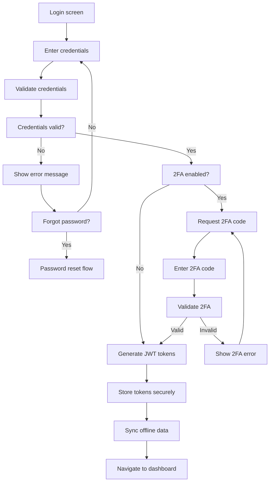

#### Error Handling
- Invalid credentials: Clear, helpful error messages
- Account locked: Show unlock instructions
- Network issues: Retry mechanism with exponential backoff
- Offline mode: Allow local authentication with cached credentials

### 1.3 First-time User Experience

**Guided Tour Components:**
1. **Dashboard Overview**: Explain tabs (Notes, Tasks, Issues)
2. **Create First Note**: Interactive tutorial
3. **Team Features**: If part of a group, show collaboration features
4. **Offline Capabilities**: Demonstrate offline mode
5. **Settings Tour**: Key settings and customizations

## Flow 2: Note Management

### 2.1 Create Note Flow

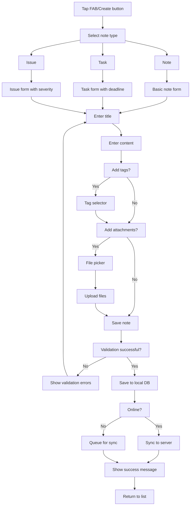

#### Form Validation Rules
```typescript
interface NoteValidation {
  title: {
    required: true;
    maxLength: 500;
    noHtml: true;
  };
  content: {
    maxLength: 50000;
    allowedHtml: ['b', 'i', 'u', 'p', 'br', 'ul', 'ol', 'li'];
  };
  tags: {
    maxCount: 10;
    maxLength: 50;
    alphanumeric: true;
  };
  files: {
    maxSize: 10 * 1024 * 1024; // 10MB
    allowedTypes: ['pdf', 'jpg', 'png', 'gif', 'doc', 'docx'];
    maxCount: 5;
  };
}
```

### 2.2 Edit Note Flow

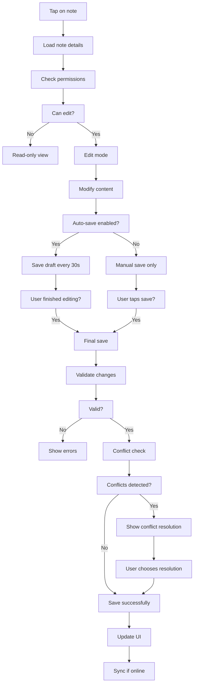

#### Conflict Resolution UI
- Side-by-side comparison view
- Highlight differences
- Options: Keep mine, Use theirs, Merge manually
- Version history access

### 2.3 Delete Note Flow

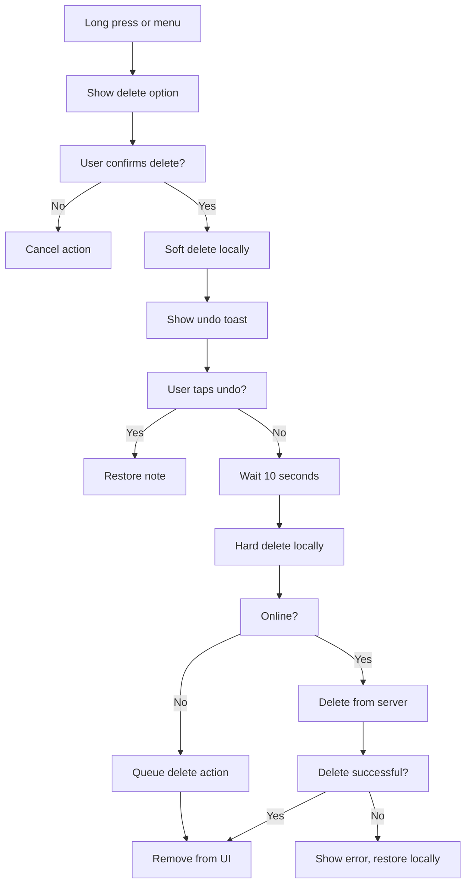

## Flow 3: Task Management

### 3.1 Task Creation with Assignment

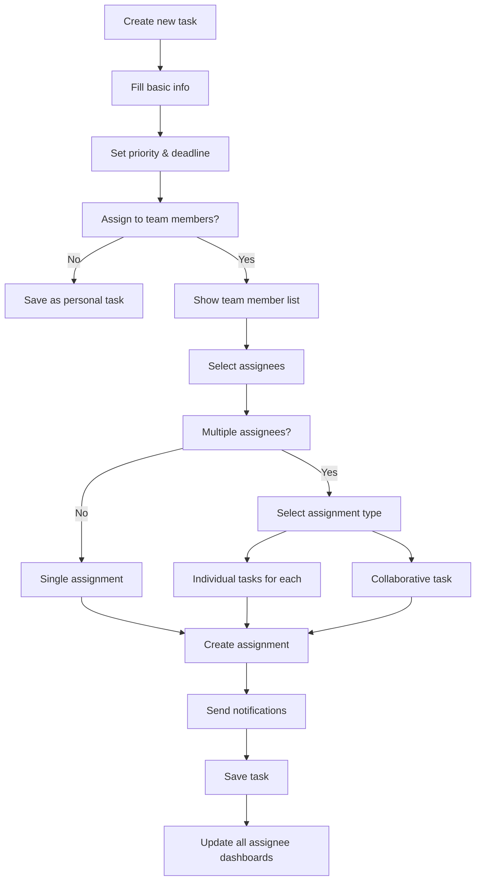

#### Assignment Types
```typescript
enum AssignmentType {
  INDIVIDUAL = 'individual', // Separate task for each assignee
  COLLABORATIVE = 'collaborative', // Shared task, multiple assignees
  SEQUENTIAL = 'sequential', // One person at a time
  PARALLEL = 'parallel' // Everyone works simultaneously
}
```

### 3.2 Task Status Update Flow

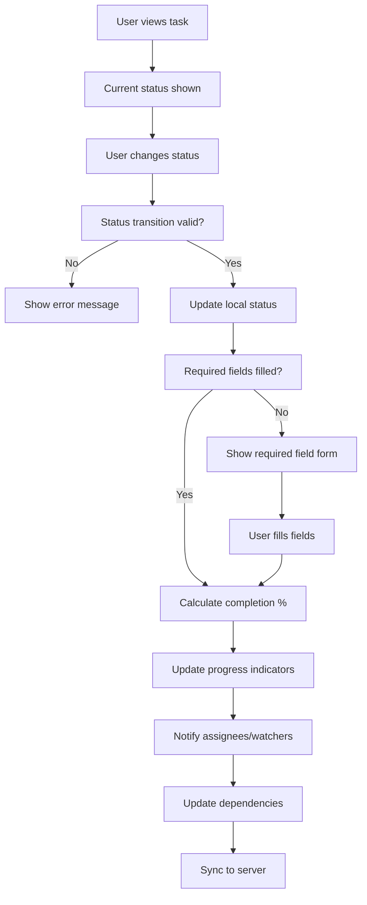

#### Status Transition Rules
```typescript
interface StatusTransitions {
  'todo': ['in_progress', 'cancelled'];
  'in_progress': ['done', 'blocked', 'todo'];
  'blocked': ['in_progress', 'cancelled'];
  'done': ['in_progress']; // Allow reopening
  'cancelled': ['todo'];
}
```

### 3.3 Kanban Board Interaction

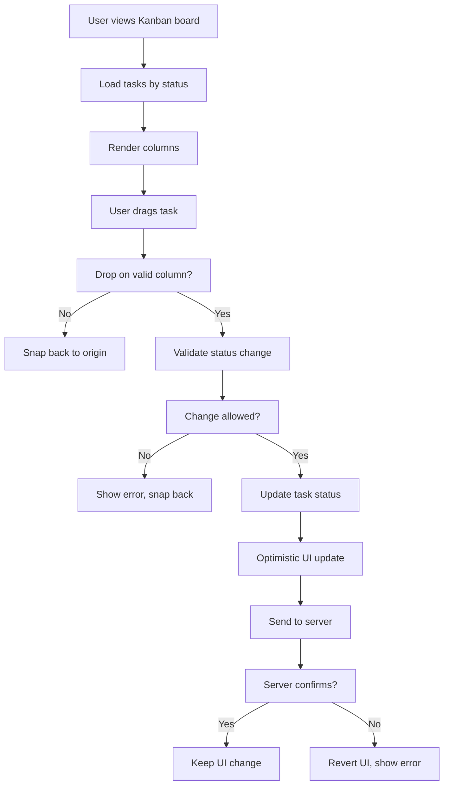

## Flow 4: Group Management

### 4.1 Group Creation Flow

```mermaid
flowchart TD
    A[User clicks 'Create Group'] --> B[Check group creation limit]
    B --> C[Under limit?]
    C -->|No| D[Show upgrade message]
    C -->|Yes| E[Show group creation form]
    
    E --> F[Enter group details]
    F --> G[Group name]
    F --> H[Description (optional)]
    F --> I[Avatar (optional)]
    
    G --> J[Validate group name]
    J --> K[Name available?]
    K -->|No| L[Show error, suggest alternatives]
    K -->|Yes| M[Create group]
    
    M --> N[Set user as admin]
    N --> O[Update group creation count]
    O --> P[Show success message]
    P --> Q[Navigate to group dashboard]
```

#### Group Creation Validation
```typescript
interface GroupValidation {
  name: {
    required: true;
    minLength: 3;
    maxLength: 50;
    noSpecialChars: true;
  };
  description: {
    maxLength: 500;
  };
  memberLimit: {
    free: 5;
    premium: 50;
  };
}
```

### 4.2 Group Invitation Flow

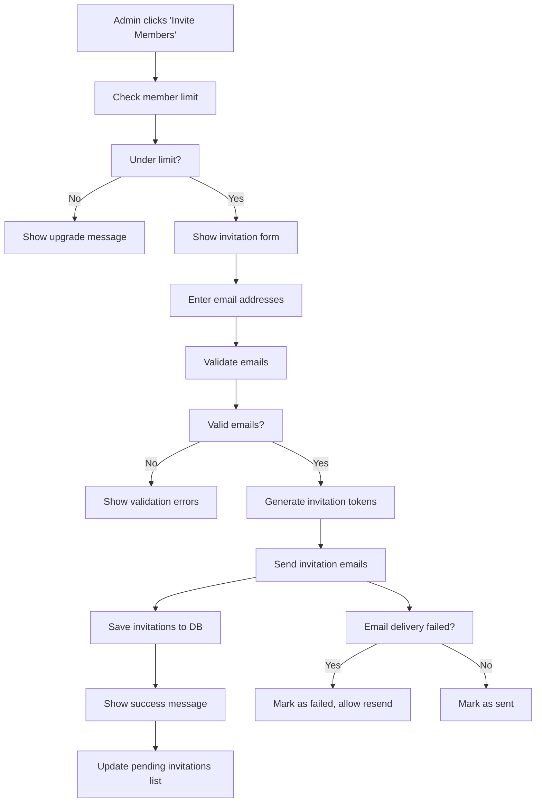

#### Invitation Email Template
```typescript
interface InvitationEmail {
  to: string;
  subject: string;
  templateData: {
    groupName: string;
    inviterName: string;
    invitationLink: string;
    expiresAt: Date;
  };
}
```

### 4.3 Group Member Management Flow

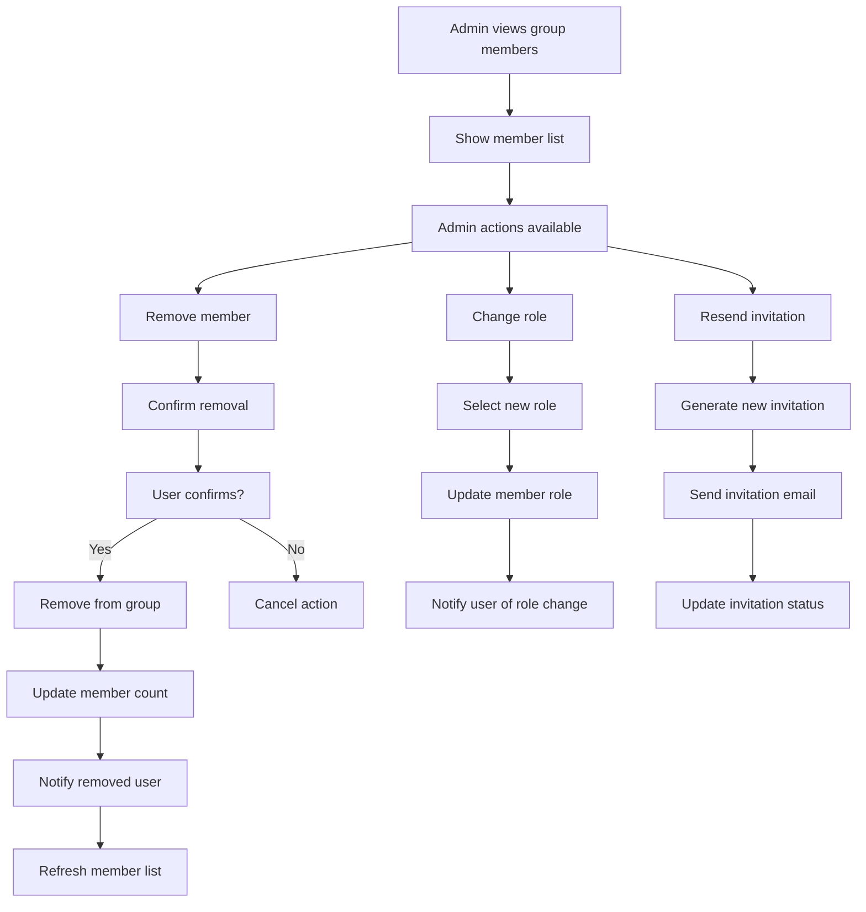

### 4.4 Group Settings Management

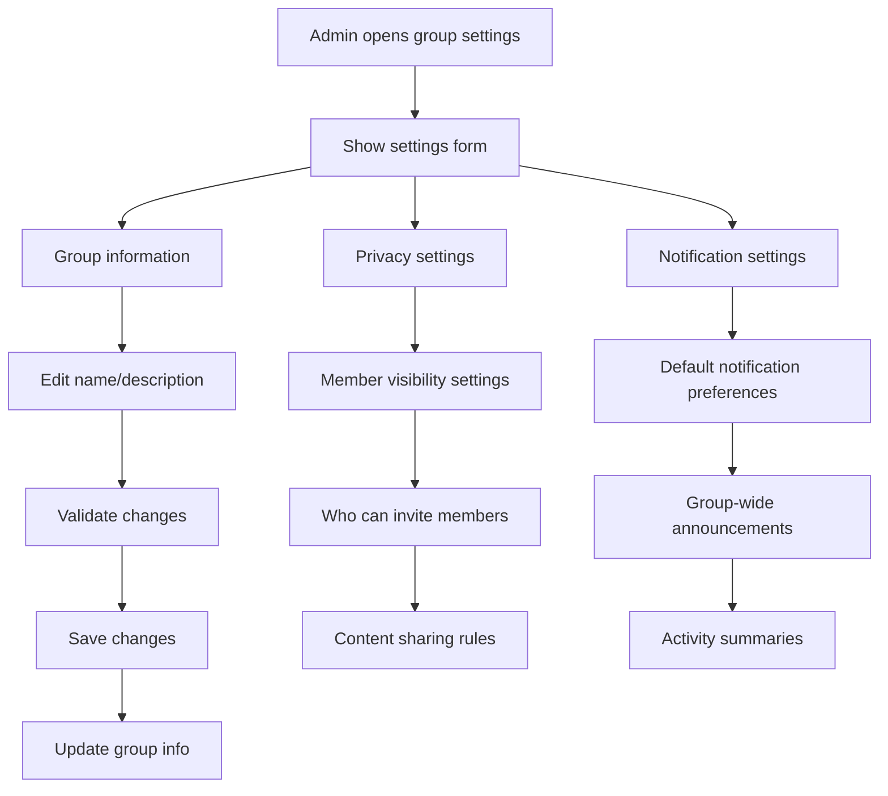

## Flow 11: Team Collaboration (Renamed from Flow 4)

### 5.1 Commenting Flow

```mermaid
flowchart TD
    A[User opens note/task] --> B[Scroll to comments section]
    B --> C[Click 'Add Comment']
    C --> D[Comment composer opens]
    D --> E[User types comment]
    
    E --> F[@mention detected?]
    F -->|Yes| G[Show mention suggestions]
    F -->|No| H[Continue typing]
    G --> I[User selects from suggestions]
    I --> H
    
    H --> J[User submits comment]
    J --> K[Validate content]
    K --> L[Valid?]
    L -->|No| M[Show validation errors]
    L -->|Yes| N[Save comment locally]
    
    N --> O[Send notifications to mentions]
    O --> P[Update UI immediately]
    P --> Q[Sync to server]
    Q --> R[Broadcast to other users]
```

#### Mention System
```typescript
interface MentionSuggestion {
  id: string;
  name: string;
  email: string;
  avatar?: string;
  role: 'admin' | 'member';
  lastActive: Date;
}

// Mention parsing
const mentionRegex = /@(\w+)/g;
const parseMentions = (text: string): string[] => {
  const matches = text.match(mentionRegex);
  return matches?.map(match => match.substring(1)) || [];
};
```

### 5.2 Real-time Collaboration

```mermaid
flowchart TD
    A[User opens shared note] --> B[Establish WebSocket connection]
    B --> C[Subscribe to note updates]
    C --> D[Show online users]
    D --> E[User starts editing]
    
    E --> F[Send typing indicator]
    F --> G[Broadcast to other users]
    G --> H[Show typing indicators]
    H --> I[User makes changes]
    
    I --> J[Debounce changes (500ms)]
    J --> K[Send operational transform]
    K --> L[Apply to other clients]
    L --> M[Resolve conflicts]
    M --> N[Update all UIs]
```

#### Operational Transform Example
```typescript
interface Operation {
  type: 'insert' | 'delete' | 'retain';
  position: number;
  content?: string;
  length?: number;
  author: string;
  timestamp: number;
}

class OperationalTransform {
  static transform(op1: Operation, op2: Operation): [Operation, Operation] {
    // Implement transformation logic based on operation types
    // This ensures concurrent edits don't conflict
  }
  
  static apply(document: string, operation: Operation): string {
    switch (operation.type) {
      case 'insert':
        return document.slice(0, operation.position) + 
               operation.content + 
               document.slice(operation.position);
      case 'delete':
        return document.slice(0, operation.position) + 
               document.slice(operation.position + operation.length!);
      default:
        return document;
    }
  }
}
```

### 5.3 File Sharing Flow

```mermaid
flowchart TD
    A[User clicks attach file] --> B[File picker opens]
    B --> C[User selects file(s)]
    C --> D[Validate file size & type]
    D --> E[Validation passed?]
    E -->|No| F[Show error message]
    E -->|Yes| G[Show upload progress]
    
    G --> H[Start upload to server]
    H --> I[Upload chunks (for large files)]
    I --> J[All chunks uploaded?]
    J -->|No| K[Continue upload]
    J -->|Yes| L[Server processing]
    
    K --> I
    L --> M[Generate thumbnails/previews]
    M --> N[Scan for viruses]
    N --> O[All checks passed?]
    O -->|No| P[Delete file, notify user]
    O -->|Yes| Q[File available for download]
    
    Q --> R[Update UI with file link]
    R --> S[Notify team members]
```

#### File Upload Security
```typescript
interface FileValidation {
  maxSize: number; // 10MB
  allowedTypes: string[];
  scanForViruses: boolean;
  generateThumbnails: boolean;
}

const validateFile = (file: File): ValidationResult => {
  // Check file size
  if (file.size > MAX_FILE_SIZE) {
    return { valid: false, error: 'File too large' };
  }
  
  // Check file type
  const extension = file.name.split('.').pop()?.toLowerCase();
  if (!ALLOWED_EXTENSIONS.includes(extension)) {
    return { valid: false, error: 'File type not allowed' };
  }
  
  // Additional MIME type validation
  if (!ALLOWED_MIME_TYPES.includes(file.type)) {
    return { valid: false, error: 'Invalid file format' };
  }
  
  return { valid: true };
};
```

## Flow 11: Offline/Online Synchronization

### 5.1 Going Offline Flow

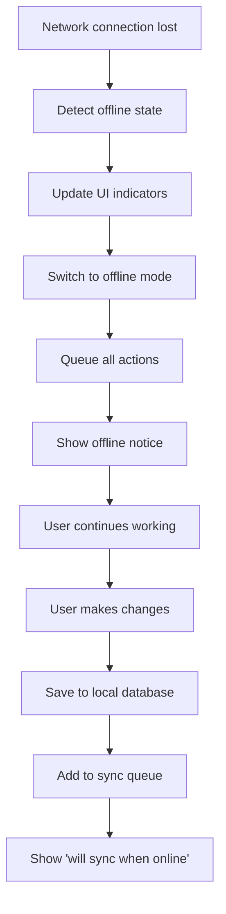

### 5.2 Coming Online Flow

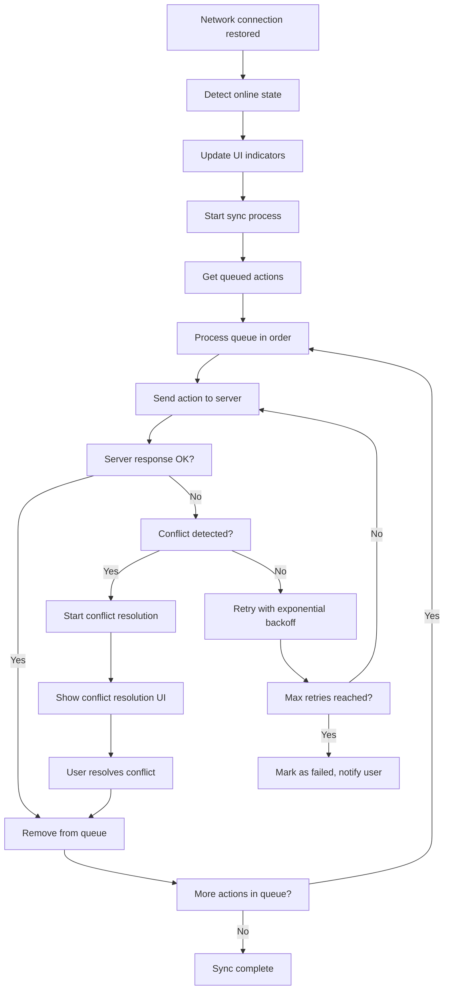

### 5.3 Conflict Resolution Flow

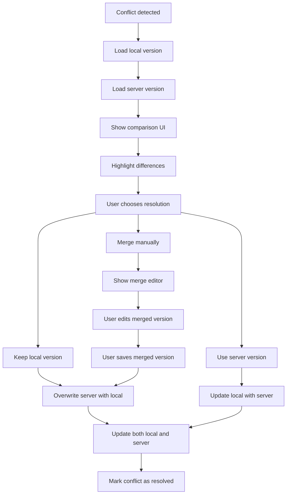

#### Conflict Resolution UI Components
```typescript
interface ConflictResolution {
  conflictType: 'content' | 'metadata' | 'delete';
  localVersion: any;
  serverVersion: any;
  baseVersion?: any; // For three-way merge
  resolution?: 'local' | 'server' | 'manual';
  mergedContent?: any;
}

const ConflictResolver: React.FC<{
  conflict: ConflictResolution;
  onResolve: (resolution: ConflictResolution) => void;
}> = ({ conflict, onResolve }) => {
  // Render side-by-side comparison
  // Provide resolution options
  // Handle manual merge editor
};
```

## Flow 11: Search & Discovery

### 6.1 Search Flow

```mermaid
flowchart TD
    A[User enters search query] --> B[Query length > 2 chars?]
    B -->|No| C[Show recent searches]
    B -->|Yes| D[Debounce input (300ms)]
    
    D --> E[Parse search query]
    E --> F[Extract filters]
    F --> G[Search local database first]
    G --> H[Display local results]
    
    H --> I[Online?]
    I -->|Yes| J[Search server database]
    I -->|No| K[Show 'offline results only']
    
    J --> L[Merge server results]
    L --> M[Remove duplicates]
    M --> N[Sort by relevance]
    N --> O[Display final results]
    
    C --> P[User selects recent search]
    P --> D
```

#### Search Query Parsing
```typescript
interface SearchQuery {
  text: string;
  filters: {
    type?: 'note' | 'task' | 'issue';
    status?: string;
    assignee?: string;
    dateRange?: [Date, Date];
    tags?: string[];
  };
  sortBy?: 'relevance' | 'date' | 'title';
  limit: number;
}

const parseSearchQuery = (input: string): SearchQuery => {
  const filters: any = {};
  let text = input;
  
  // Extract type filter: type:task
  const typeMatch = input.match(/type:(\w+)/);
  if (typeMatch) {
    filters.type = typeMatch[1];
    text = text.replace(typeMatch[0], '').trim();
  }
  
  // Extract assignee filter: assignee:john
  const assigneeMatch = input.match(/assignee:(\w+)/);
  if (assigneeMatch) {
    filters.assignee = assigneeMatch[1];
    text = text.replace(assigneeMatch[0], '').trim();
  }
  
  // Extract tags: #urgent #bug
  const tagMatches = input.match(/#(\w+)/g);
  if (tagMatches) {
    filters.tags = tagMatches.map(tag => tag.substring(1));
    text = text.replace(/#\w+/g, '').trim();
  }
  
  return { text, filters, limit: 20 };
};
```

### 6.2 Advanced Filter Flow

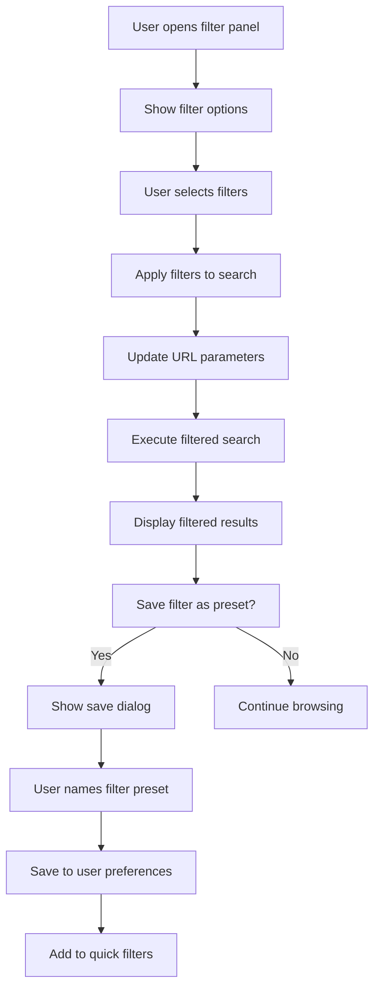

## Flow 11: Settings & Preferences

### 7.1 Account Settings Flow

```mermaid
flowchart TD
    A[User opens settings] --> B[Show settings categories]
    B --> C[Account & Profile]
    B --> D[Notifications]
    B --> E[Privacy & Security]
    B --> F[Data & Sync]
    
    C --> G[Edit profile information]
    G --> H[Update name/email/avatar]
    H --> I[Validate changes]
    I --> J[Save to server]
    
    D --> K[Configure notification preferences]
    K --> L[Toggle notification types]
    L --> M[Set quiet hours]
    M --> N[Test notification]
    
    E --> O[Password change]
    E --> P[2FA setup]
    E --> Q[Privacy settings]
    
    F --> R[Backup/Export data]
    F --> S[Sync preferences]
    F --> T[Storage management]
```

### 7.2 Two-Factor Authentication Setup

```mermaid
flowchart TD
    A[User enables 2FA] --> B[Choose 2FA method]
    B --> C[Authenticator app]
    B --> D[SMS]
    B --> E[Email]
    
    C --> F[Generate QR code]
    F --> G[User scans QR code]
    G --> H[User enters verification code]
    H --> I[Verify code]
    I --> J[Code valid?]
    J -->|No| K[Show error, retry]
    J -->|Yes| L[Generate backup codes]
    
    D --> M[Enter phone number]
    M --> N[Send SMS code]
    N --> O[User enters SMS code]
    O --> I
    
    E --> P[Email verification code]
    P --> Q[User enters email code]
    Q --> I
    
    L --> R[Display backup codes]
    R --> S[User confirms codes saved]
    S --> T[Enable 2FA]
    T --> U[Show success message]
```

## Flow 11: Error Handling & Recovery

### 8.1 Network Error Flow

```mermaid
flowchart TD
    A[Network request fails] --> B[Determine error type]
    B --> C[Connection timeout]
    B --> D[Server error (5xx)]
    B --> E[Client error (4xx)]
    B --> F[Network unavailable]
    
    C --> G[Retry with exponential backoff]
    D --> G
    E --> H[Show specific error message]
    F --> I[Switch to offline mode]
    
    G --> J[Max retries reached?]
    J -->|No| K[Wait and retry]
    J -->|Yes| L[Show error, suggest actions]
    
    H --> M[User can retry manually]
    I --> N[Queue action for later sync]
```

### 8.2 Data Recovery Flow

```mermaid
flowchart TD
    A[Data corruption detected] --> B[Attempt local recovery]
    B --> C[Check local backup]
    C --> D[Backup available?]
    D -->|Yes| E[Restore from backup]
    D -->|No| F[Sync from server]
    
    E --> G[Verify restored data]
    F --> H[Server has data?]
    H -->|Yes| I[Download from server]
    H -->|No| J[Data permanently lost]
    
    G --> K[Data integrity OK?]
    I --> K
    K -->|Yes| L[Recovery successful]
    K -->|No| M[Partial recovery]
    
    J --> N[Notify user of data loss]
    M --> O[Show what was recovered]
    L --> P[Resume normal operation]
```

## Flow 11: Performance Optimization

### 9.1 Lazy Loading Flow

```mermaid
flowchart TD
    A[User scrolls list] --> B[Near bottom of list?]
    B -->|No| C[Continue normal scrolling]
    B -->|Yes| D[Load more items needed?]
    D -->|No| E[Show 'no more items']
    D -->|Yes| F[Start loading more]
    
    F --> G[Show loading indicator]
    G --> H[Fetch next page]
    H --> I[Data received?]
    I -->|Yes| J[Append to existing list]
    I -->|No| K[Show error, retry option]
    
    J --> L[Update UI smoothly]
    L --> M[Continue monitoring scroll]
    K --> N[User retries?]
    N -->|Yes| F
    N -->|No| O[Stop loading]
```

### 9.2 Cache Management Flow

```mermaid
flowchart TD
    A[App starts] --> B[Check cache size]
    B --> C[Cache size OK?]
    C -->|Yes| D[Load from cache]
    C -->|No| E[Start cache cleanup]
    
    E --> F[Remove old items]
    F --> G[Remove least used items]
    G --> H[Compress remaining data]
    H --> I[Cache size acceptable?]
    I -->|Yes| D
    I -->|No| J[Clear cache completely]
    
    D --> K[Cache hit?]
    K -->|Yes| L[Use cached data]
    K -->|No| M[Fetch from server]
    
    M --> N[Store in cache]
    N --> L
    J --> M
```

## Flow 11: Accessibility Features

### 10.1 Voice Control Flow

```mermaid
flowchart TD
    A[User activates voice control] --> B[Request microphone permission]
    B --> C[Permission granted?]
    C -->|No| D[Show permission explanation]
    C -->|Yes| E[Start listening]
    
    E --> F[User speaks command]
    F --> G[Convert speech to text]
    G --> H[Parse command]
    H --> I[Command recognized?]
    I -->|No| J[Ask for clarification]
    I -->|Yes| K[Execute command]
    
    K --> L[Provide voice feedback]
    L --> M[Continue listening?]
    M -->|Yes| E
    M -->|No| N[Stop voice control]
    
    J --> O[Suggest similar commands]
    O --> P[User tries again?]
    P -->|Yes| E
    P -->|No| N
```

### 10.2 Screen Reader Support Flow

```mermaid
flowchart TD
    A[Screen reader detected] --> B[Activate accessibility mode]
    B --> C[Enhance focus indicators]
    C --> D[Add ARIA labels]
    D --> E[Provide context descriptions]
    
    E --> F[User navigates with keyboard]
    F --> G[Announce current element]
    G --> H[Provide action hints]
    H --> I[User performs action]
    I --> J[Announce result]
    J --> K[Update focus appropriately]
```

These user flows provide comprehensive guidance for implementing a user-friendly, accessible, and robust NoteFlow application that handles various scenarios and edge cases effectively.